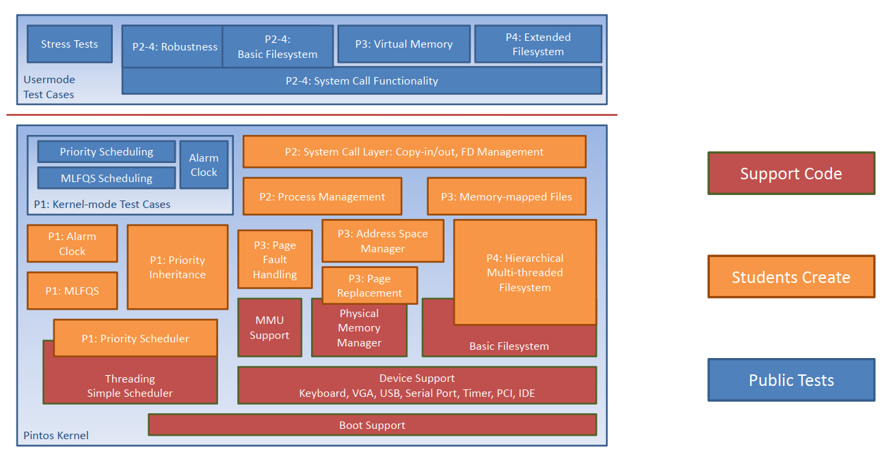

# Pintos

## Contribution
This project was done by:
* Menna Salah
* Mennatullah Waleed
* Noran Al-sadig
* Sama Elmoataz
* Hala Elmoataz

## About

PintOS is an open source instructional operating system kernel developed by Stanford University. PintOS provides complete documentation & modular projects to introduce students to the major concepts of operating systems development. The components of PintOS project is illustrated in the following figure.

The project is divided into two phases:

* P1: Threads
* P2: User Programs

## Source Code

Source code is adopted from the open source project at [PintOS-OS](https://pintos-os.org/), we will try to keep this repository in sync with the official repository at [PintOS-OS Official Repository](https://pintos-os.org/cgi-bin/gitweb.cgi?p=pintos-anon;a=summary).

